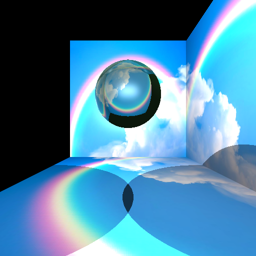
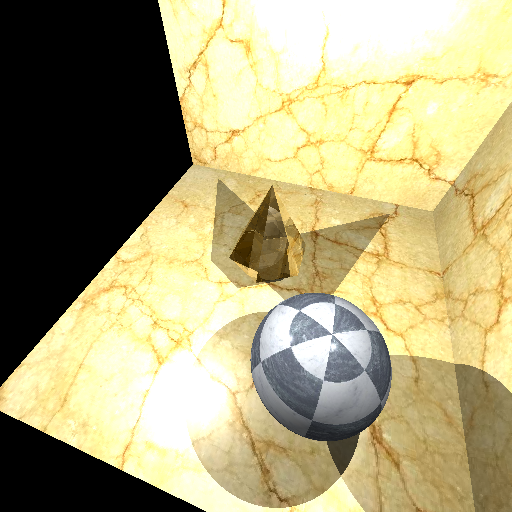
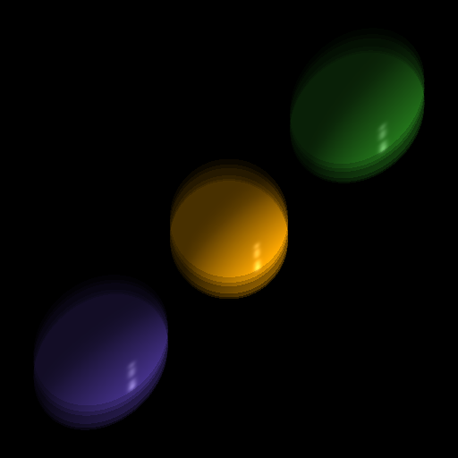
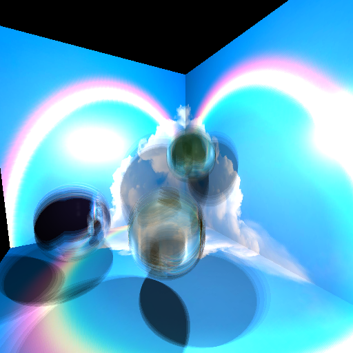
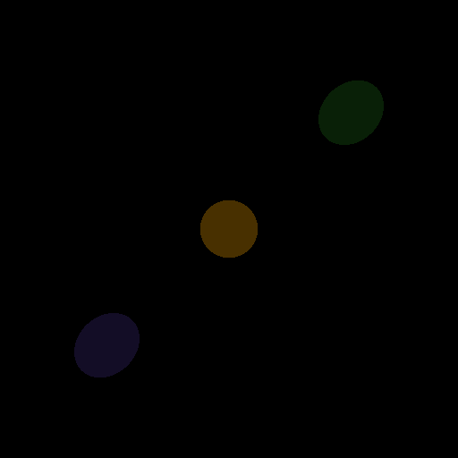
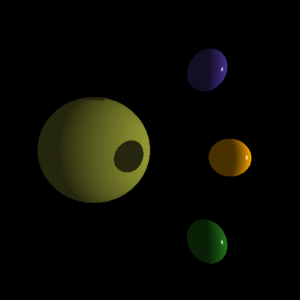

# RayTracer in Java

This is a simple RayTracer that I programmed using Java.
Initially this was a University project of my Computer Graphics course in the University of Vienna, but I decided to change a few things and make it publicly available.

My RayTracer reads in a scene from an `.xml` file and creates a picture of it using the raytracing algorithm.
This means, from the camera position, it shoots a ray through every pixel of the picture and checks if it hits an object.
If it does, it calculates the color of the pixel depending on the object's material and the light sources in the scene. If it doesn't hit an object, the pixel will be black.

# Example images
Here are some example images that I created with my RayTracer:   
Super sampling (example6 and example8):  

  Motion blur (example2 and example7):  

  Animation (example1 and example3):  

# Features
The RayTracer can have the following light sources:
- ambient light (light that is everywhere in the scene)
- point light (light that comes from a specific point in the scene)
- parallel light (light that comes from a specific direction in the scene)
- spotlight (light that comes from a specific point in the scene and has a specific direction)

The RayTracer can have the following objects:
- spheres
- meshes (objects that are loaded from an `.obj` file)

The RayTracer can have the following materials:
- solid material (a material that has a specific color)
- textured material (a material that has a specific texture from an image file)

> More about this in the [How to get or create scenes](#how-to-get-or-create-scenes) section.

The RayTracer can also create images with:
- super sampling (create a better quality by shooting 25 rays through one pixel instead of just one)
- animations (makes spheres bigger and smaller)
- motion blur (moves the spheres around to make the image look blurry)

>Note: creating images with super sampling, animation or motion blur will take a bit longer then just creating a normal scene, but since I also added multithreading the process of raytracing the scenes is done in a moderate amount of time.

# How to run
First clone the repository. 
Then you can run the program in two ways:
- open the project with an IDE and run the `Main` function
- using the command: `gradlew run` or `./gradlew run` (depending on your OS)

# How to use
The program will print out the following message displaying the commands you can use:  

Commands:  
- `<sceneName>` -> raytrace the selected scene from the scenes' folder (e.g. 'example1', 'example2')
- `all` -> creates all scenes (all .xml files saved in the scene folder)
- `<sceneName/all> -animation` -> adds animation (only spheres) to the selected scene/all scenes
- `<sceneName/all> -motionblur` -> adds motion blur (only spheres) to the selected scene/all scenes
- `<sceneName/all> -supersampling` -> creates a scene using super sampling (shooting 25 rays through one pixel instead of just one)
- `help` -> prints the commands again
- `exit` -> exit the program

and then it will ask you to type in a command: 
`Scene/Effect name: <your input>` 

Depending on what you type in, the program will create the scene or scenes you asked for and save them as `.png` or `.gif` in the `outputPictures` folder. 

# How to get or create scenes
There is a folder called `scenes` where you can find some example scenes as `.xml` files and their needed textures or objects. 
You can either stick with those or create your own scenes.
To do so you might want to take a look at the `scene.dtd` file to see what you can do or get inspired by the example scenes. 

